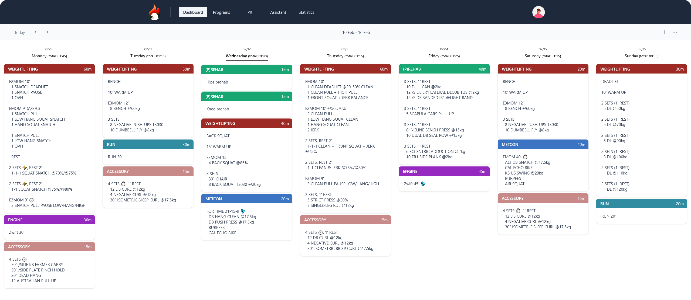
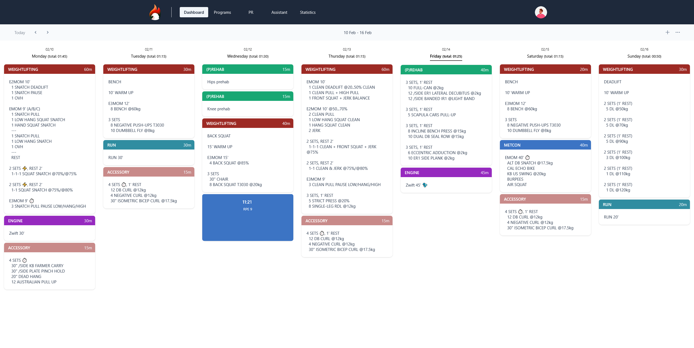
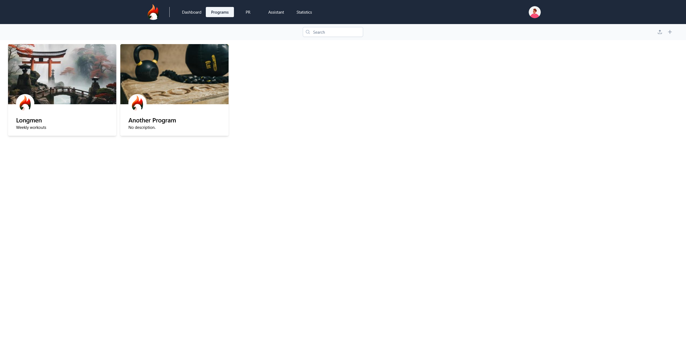

<p align="center"></p>
<h2 align="center">Wingfit</h2>

<div align="center">


[](https://github.com/itskovacs/wingfit/issues)
[](/LICENSE)

</div>

<p align="center">🏋️ The wingman for your fitness </p>
<br>

<div align="center">



</div>

## 📝 Table of Contents

- 📦 [About](#about)
- 🌱 [Getting Started](#getting_started)
- 📸 [Demo](#Demo)
- 🚧 [Roadmap](#Roadmap)
- 📜 [License](#License)
- 🤝 [Contributing](#Contributing)
- 🛠️ [Tech Stack](#techstack)
- ✍️ [Authors](#authors)

## 📦 About <a name = "about"></a>

Wingfit is a minimalist fitness app to organize your workouts and track your personal records. Demo is worth a thousand words, head to 📸 [Demo](#Demo).

🔒 Privacy-First – No telemetry, no tracking, fully self-hostable. You own your data. Inspect, modify, and contribute freely.

<br>

## 🌱 Getting Started <a name = "getting_started"></a>

These steps will guide to deploy the app, ready to use in ⏱️ minutes.  
If you need help, feel free to open an [issue](https://github.com/itskovacs/wingfit/issues).

### Preparation

Clone the repo, you're one step away from being all set

```bash
git clone https://github.com/itskovacs/wingfit.git
cd wingfit
```

### Docker 🐳 (recommended)

If needed, edit `docker-compose.yml` to modify the mapped port (default is 127.0.0.1:8080).

Run the container, head to Wingfit website, create an account, enjoy ✅

```bash
docker compose up -d
```

### Serving the content
You can serve Wingfit using a web server, eg: Nginx
```nginx
server {
    listen 443 ssl;
    listen [::]:443 ssl;

    server_name wingfit.lan; # Your wingfit domain

    location / {
        proxy_pass http://localhost:8080; # Wingfit port, default is 8080
        proxy_set_header Host               $host;
        proxy_set_header X-Real-IP          $remote_addr;
        proxy_set_header X-Forwarded-For    $proxy_add_x_forwarded_for;
        proxy_set_header X-Forwarded-Proto  $scheme;
        proxy_set_header Upgrade            $http_upgrade;
        proxy_set_header Connection         "upgrade";
    }
}
```


### Sources 👩‍💻

Install from sources and run the backend.
Build the frontend and serve it with the web server.

**backend**

```bash
cd backend

# Source virtual environment
python -m venv venv
source venv/bin/activate

# Install dependencies
pip install .

# Run the backend, port :8080
fastapi run fastapp:app
```

You can specify

**frontend**

```bash
cd frontend

# Install dependencies
npm install

# Build the frontend
npm build

# Copy the build to your static web server directory
cp -r dist/wingfit/browser /var/www/html
```

<br>

## 📸 Demo <a name = "demo"></a>

<div align="center">

|         |         |
|:-------:|:-------:|
|  |  |
|  |  |

</div>

<br>

## 🚧 Roadmap <a name = "roadmap"></a>

New features coming soon<sup>TM</sup>, check out the development plan in the [Roadmap Wiki](https://github.com/itskovacs/wingfit/wiki/Roadmap).

<br>

## 📜 License <a name = "license"></a>

I decided to license Wingfit under the **CC BY-NC-SA 4.0** – You may use, modify, and share freely with attribution, but **commercial use is prohibited**.

<br>

## 🤝 Contributing <a name = "contributing"></a>

Contributions are welcome! Feel free to open issues if you find bugs and pull requests for your new features!

1. Fork the repo
2. Create a new branch (`my-new-wingfit-feature`)
3. Commit changes
4. Open a pull request

<br>

## 🛠️ Tech Stack <a name = "techstack"></a>

### **Frontend**

- 🅰️ Angular (Progressive Web App)
- 🏗️ PrimeNG
- 🎨 Tailwind CSS

### **Backend**

- 🐍 FastAPI, SQLModel
- 🗃️ SQLite

<br>

## ✍️ Authors <a name = "authors"></a>

- [@itskovacs](https://github.com/itskovacs)

<br>

<div align="center">

If you like Wingfit, consider giving it a **star** ⭐!  
Made with ❤️ in BZH

</div>
